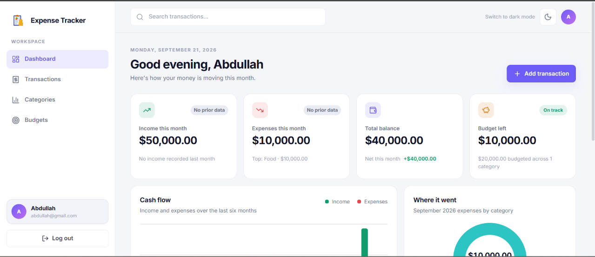
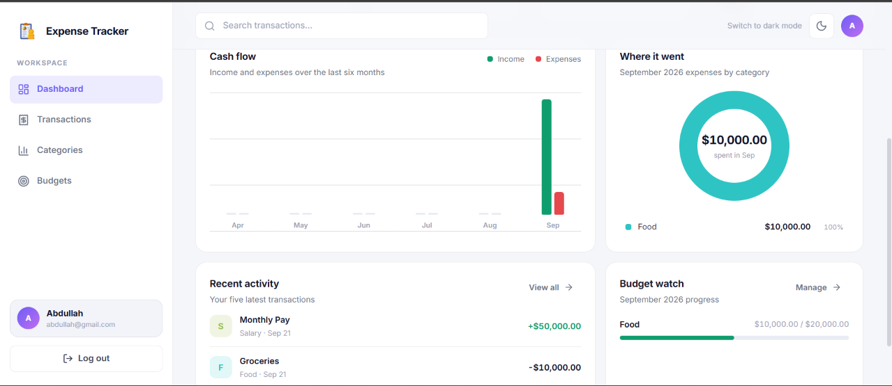
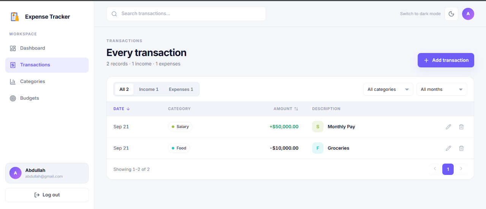
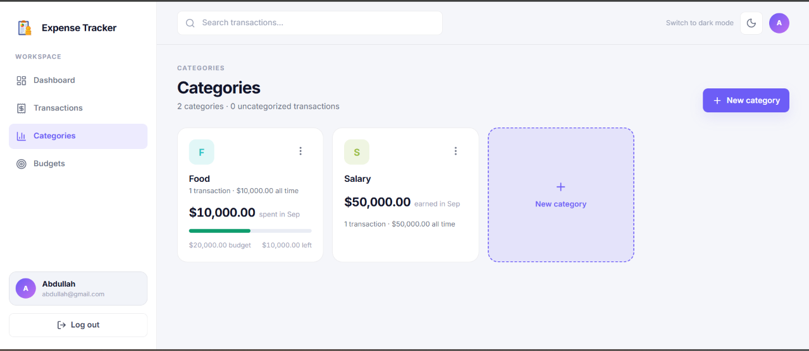
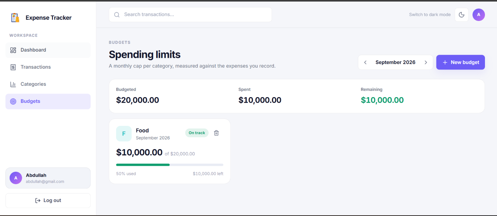

# 💰 Personal Expense Tracker

A full-stack personal finance management application for tracking **income, expenses, categories, and monthly budgets**.

The application provides a React frontend connected to a FastAPI REST API and PostgreSQL database. It includes JWT authentication, user-specific authorization, transaction management, budgeting, filtering, pagination, and financial dashboard summaries.

---

## ✨ Features

* 🔐 User registration & JWT authentication
* 🔒 Secure password hashing with Argon2
* 💸 Create, update, delete, and view transactions
* 🏷️ Personal transaction categories
* 🔎 Filter transactions by type, category, and date
* 📄 Transaction pagination
* 💰 Monthly category budgets
* 📊 Dashboard with income, expenses, balance, and category breakdown
* 👤 User-specific data authorization
* 🔗 Frontend and backend REST API integration

---

## 🛠️ Tech Stack

### Frontend

* JavaScript / JSX
* React 19
* Vite
* Tailwind CSS
* Axios
* Lucide React

### Backend

* Python
* FastAPI
* SQLAlchemy
* Pydantic
* JWT Authentication
* Argon2

### Database

* PostgreSQL

---

## 🏗️ Architecture

```text
React Frontend
      ↓
   Axios / REST API
      ↓
FastAPI Backend
      ↓
Authentication & Business Logic
      ↓
SQLAlchemy ORM
      ↓
PostgreSQL
```

The **frontend** handles the user interface and sends requests to the backend.

The **FastAPI backend** handles authentication, authorization, validation, business logic, and database operations.

**PostgreSQL** stores users, categories, transactions, and budgets.

---

## 🔐 Authentication & Authorization

Users register and log in through the frontend.

```text
Register
   ↓
Validate user data
   ↓
Hash password with Argon2
   ↓
Store user in PostgreSQL

Login
   ↓
Verify credentials
   ↓
Generate JWT
   ↓
Frontend sends JWT with protected requests
```

The backend uses the authenticated user's ID to ensure users can only access and modify their own financial data.

---

## 💸 How the Backend Works

### Transactions

When a user creates a transaction:

```text
Frontend
   ↓
API Request
   ↓
JWT Authentication
   ↓
Validate Request
   ↓
Check User / Category
   ↓
SQLAlchemy
   ↓
PostgreSQL
   ↓
API Response
   ↓
Frontend
```

Transactions support income/expense types, categories, dates, filtering, and pagination.

### Budgets

Users can create monthly budgets for categories. The backend calculates spending against the budget:

```text
Remaining = Budget Amount - Actual Spending
```

### Dashboard

The backend calculates financial summaries from the user's transactions, including:

* Total income
* Total expenses
* Balance
* Category-wise expenses

---

## 📁 Backend Structure

```text
backend/
└── app/
    ├── core/       # Configuration, database & security
    ├── models/     # SQLAlchemy database models
    ├── schemas/    # Pydantic schemas
    ├── routes/     # API endpoints
    └── main.py     # FastAPI application
```

---

## 🌐 API

Main API areas:

```text
/auth          → Registration & Login
/transactions  → Transaction management
/categories    → Category management
/budgets       → Budget management
/dashboard     → Financial summaries
```

Interactive API documentation is available through FastAPI Swagger UI at:

```text
http://127.0.0.1:8000/docs
```

---

## 🚀 Getting Started

### Backend

```bash
cd backend

python -m venv venv
venv\Scripts\activate

pip install -r requirements.txt

uvicorn app.main:app --reload
```

### Frontend

```bash
cd frontend

npm install
npm run dev
```

Create the required `.env` files for the database connection, JWT configuration, and frontend API URL.

> ⚠️ Never commit `.env` files or database credentials to GitHub.

---

## 📸 Screenshots

## Login Page


## Dashboard


## Dashboard Bottom


## Transactions Page


## Categories Page


## Budget Page

---

## 📚 What I Learned

This project provided practical experience with:

* Full-stack application architecture
* REST API development
* FastAPI
* PostgreSQL & SQLAlchemy
* JWT authentication & authorization
* Password security
* CRUD operations
* Database relationships
* Filtering & pagination
* Backend business logic
* Frontend-to-backend integration

---

## 🔮 Future Improvements

* Automated testing
* Alembic database migrations
* Dockerization
* Production deployment
* Recurring transactions
* Financial reports and exports

---

## 👨‍💻 Author

**Your Name**

Computer Science Student | Python Backend & AI/ML Enthusiast

[GitHub](YOUR_GITHUB_LINK) • [LinkedIn](YOUR_LINKEDIN_LINK)
